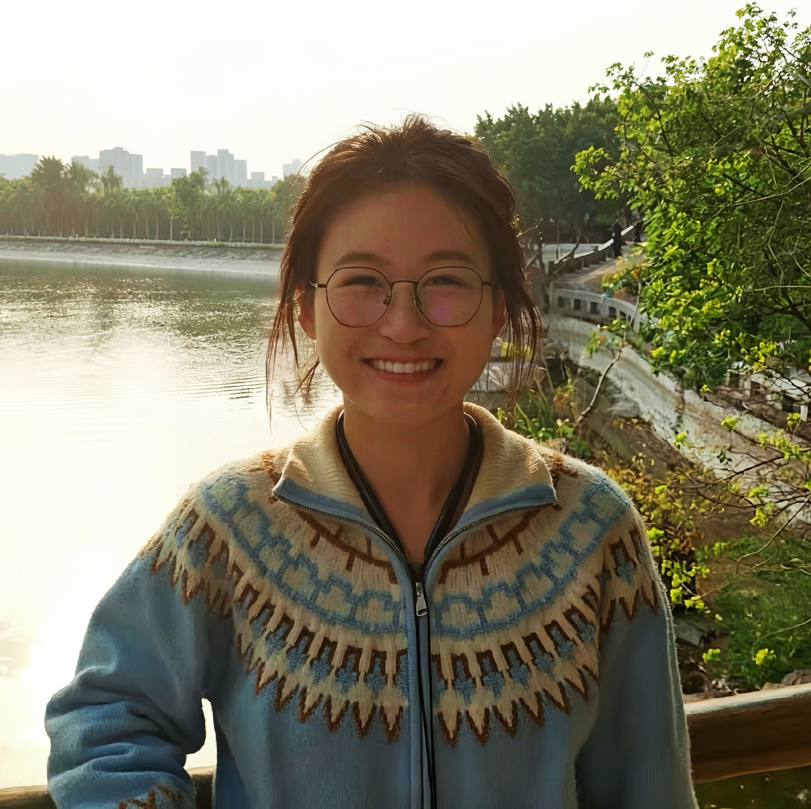

<h1 align="center">Lyra&#65288;&#21016;&#28386;&#65289;&#20010;&#20154;&#23398;&#26415;&#20027;&#39029;</h1>

  <strong>AI Undergraduate @ <a href="https://www.xmu.edu.cn/">Xiamen University</a></strong> 
  Knowledge Graphs | NLP | LLM Agents

  
  
  

## About Me

I am an undergraduate researcher at Xiamen University. My research focuses on building trustworthy, knowledge-enhanced AI systems, with particular interests in LLM Agents, scientific discovery agents, epistemic graph reasoning, and 3D generative vision.

- **Name:** Lyra (&#21016;&#28386;)
- **Undergraduate:** Artificial Intelligence, [School of Informatics](https://informatics.xmu.edu.cn/), [Xiamen University](https://www.xmu.edu.cn/)
- **Political status:** Probationary CPC Member (&#20013;&#20849;&#39044;&#22791;&#20826;&#21592;)
- **My Research Focus:** Trustworthy Artificial Intelligence, Agentic AI Systems, Knowledge-Augmented Large Language Models, Scientific Discovery Agents, Graph-based Reasoning, 3D Generative Vision

## News

- **2026.06** 🎉 Won the 2nd Prize, Fujian Division, China Collegiate Computing Design Competition.

## Educations

- **2023.09 - Present:** B.Eng. student, [School of Informatics](https://informatics.xmu.edu.cn/), [Xiamen University](https://www.xmu.edu.cn/).
- **2020.09 - 2023.06:** Student, Anhui Dingyuan High School.

## Research Interests

- **Knowledge Graphs & Epistemic Modeling:** tri-level epistemic graphs, multi-granular knowledge extraction, argumentative relation mining, and information-theoretic evaluation for low-hallucination survey synthesis.
- **LLM Agents for Scientific Research:** scientific writing agents, tool-augmented reasoning, code-to-paper automation, multi-modal research workflows, and task planning for academic tasks.
- **3D Vision & Cross-Modal Generation:** 3D Gaussian Splatting, multi-view reconstruction, cultural heritage restoration, and cross-modal alignment to ground knowledge graphs in visual data.

## Research Timeline

> Core: LLM Agents, Epistemic Knowledge Graphs | Secondary: 3D Gaussian Splatting, Cultural Heritage Reconstruction

### 2025.11 - 2026.05 | Remote Research Intern, SAIDS, USTC
**Keywords:** Scientific Agent, Code-Text Alignment, Multimodal Paper Generation  
Led full framework design of Code-to-Paper agent, proposed AuthorMarkers; co-first author (2nd) of NeurIPS 2026 submission and finished survey on generative world models.

### 2025.01 - 2026.04 | National Undergraduate Innovation Project, NLP
**Keywords:** TEG Hypergraph, Low-Hallucination Survey, GraphRAG  
Built tri-level epistemic graph framework, designed entropy-driven argument quantification; third author of PPSN 2026 paper with full ablation studies.

### 2024.12 - 2026.04 | National Undergraduate Innovation Project, 3D Vision
**Keywords:** 3DGS Restoration, Multi-View Optimization, Cultural Heritage  
Proposed dual-branch painting restoration pipeline; second author of revision manuscript and co-first author of ACM MM 2026 3D editing paper with validated metric gains.

### 2024.07 - 2026.07 | University Project 1: LLM Radio Localization
**Keywords:** LLM-Aided Simulation, Radio Map Modeling  
Served as project lead, optimized localization algorithms and completed end-to-end simulation and map construction.

### 2024.07 - 2026.07 | University Project 2: Legal Multimodal QA
**Keywords:** Vertical Domain Dataset, LLM Data Preparation  
Collected, cleaned and standardized legal corpus to provide high-quality data for domain multimodal LLMs.

### 2024.06 - 2025.06 | XMU LDK NLP & LLM Research Group
**Keywords:** RAG, Knowledge Graph, Cross-Modal 3D Vision  
Laid theoretical foundation of retrieval reasoning, epistemic modeling and fundamental 3D reconstruction techniques.

## Awards and Honors

**2026**
- China Collegiate Computing Design Competition, Fujian Division, 2nd Prize.

**2025**
- Challenge Cup Extracurricular Academic Science and Technology Works Competition, Fujian Province, 2nd Prize.
- China Undergraduate Mathematical Contest in Modeling, Fujian Province, 1st Prize.
- Baotai Cup Xiamen University Student Innovation Competition, Gold Award.
- Xiamen University Outstanding Student Cadre.
- Xiamen University Outstanding Merit Student.

**2024**
- Huawei ICT Competition Practice Track, Fujian Province, 1st Prize.

## Future Research Vision

I have long held a deep passion for computer science, a romantic field that constructs interpretable and reliable intelligence through mathematics, logic, and algorithms. I am captivated by rigorous logical reasoning within epistemic knowledge graphs, as well as the whole-process automation of academic research brought by scientific LLM agents.

My long-term research plan centers on trustworthy large language models, epistemic knowledge modeling, and low-hallucination scientific agents, while taking 3D generative reconstruction as a cross-modal auxiliary branch to support multi-scenario knowledge application.

I sincerely look forward to connecting with like-minded peers who are passionate about academic exploration. Whether your research focuses on NLP, knowledge graphs, multi-modal foundation models, or 3D vision, I am always ready for in-depth academic communication and collaborative exploration.

Just as Lyra, the Lyra constellation, chases the starlight, I keep pursuing reliable and interpretable AI research.

## GitHub Stats

  
  

## Contact

- Email: [liuying07@stu.xmu.edu.cn](mailto:liuying07@stu.xmu.edu.cn)
- GitHub: [Lyra-Ying](https://github.com/Lyra-Ying)

## Links to Add

- Blog:
- Google Scholar:
- ORCID:
- CV:
- Project pages:
